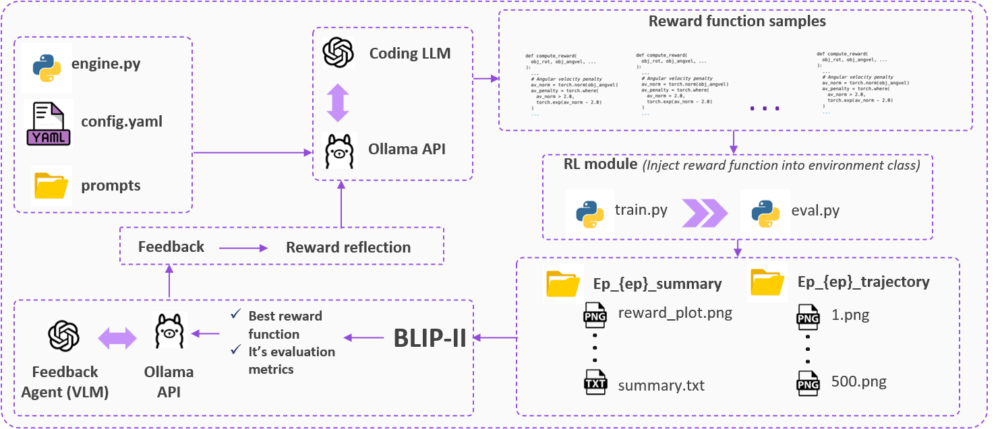

# EurekaVision



## Overview

**EurekaVision** provides the complete setup to run the proposed pipeline—featuring the BLIP Vision Scorer module and a Vision-Language Model (VLM) agent—on classic control environments from the [Gymnasium](https://gymnasium.farama.org/) suite.  
The environments supported include:

- CartPole  
- Acrobot  
- MountainCar  
- Pendulum  

The pipeline leverages prompt-based reward function generation and refinement, enabling feedback-driven reward shaping through large vision-language models.

---

## Setup Instructions

### 1. Install PyTorch

First, install PyTorch by following the instructions on the [official website](https://pytorch.org/get-started/locally/) based on your system configuration.

### 2. Clone the Repository

```bash
git clone https://github.com/sujay-2001/EurekaVision.git
cd EurekaVision
```

### 3. Install Python Dependencies

```bash
pip install -r requirements.txt
```

---

## Running the Pipeline
## Running the Pipeline

1. Configure the parameters in `configs/config.yaml` to specify:
   - Environment
   - Model details
   - Number of iterations
   - Number of samples
   - RL training, eval config

2. Run the pipeline using:

```bash
python engine.py
```

This will execute the full loop of reward generation, scoring, and refinement across the specified number of iterations.

---

## Folder Structure

```
EurekaVision/
├── configs/
│   └── config.yaml
├── envs/
│   ├── cartpole.py
│   ├── cartpole_obs.json
│   └── ...
├── utils/
│   ├── prompts/
│   │   ├── initial_system.txt
│   │   └── ...
│   ├── agents.py
│   ├── eval.py
│   ├── misc.py
│   └── train.py
├── engine.py
├── requirements.txt
└── assets/
    └── workflow.png
```

